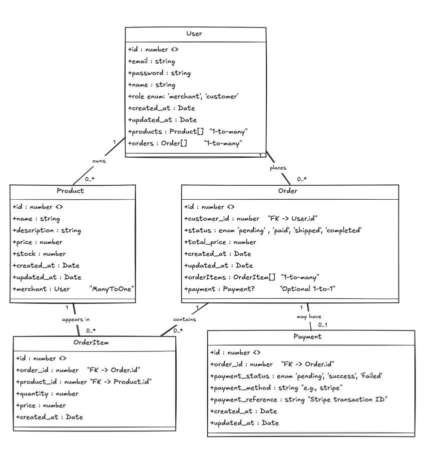
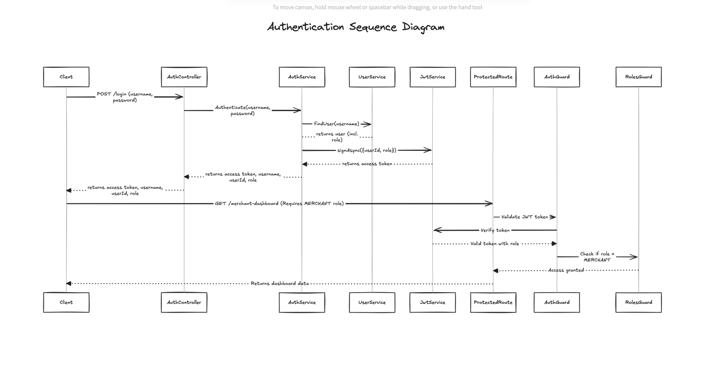

# Database Schema

# Authentication flow with JWT

# how to run the project
- clone the project
- run `npm install`
- run `npm run dev` this will start the server and the client using turbo dev
- open the browser and go to `http://localhost:3000/`
