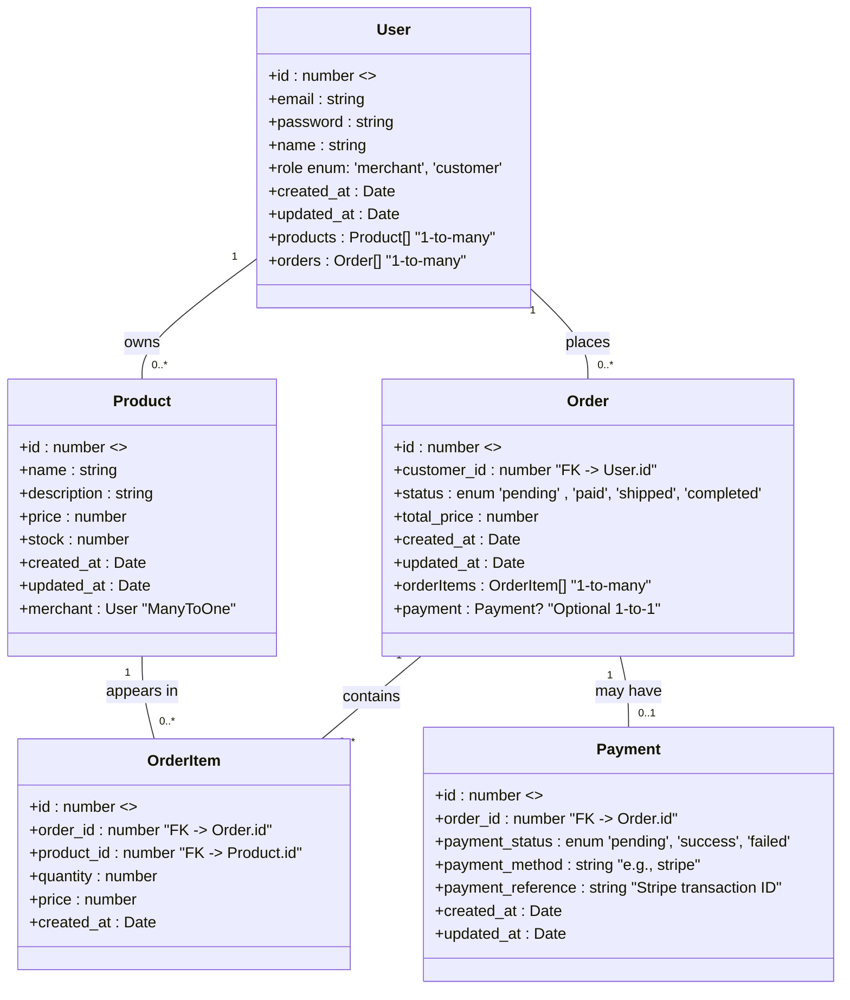
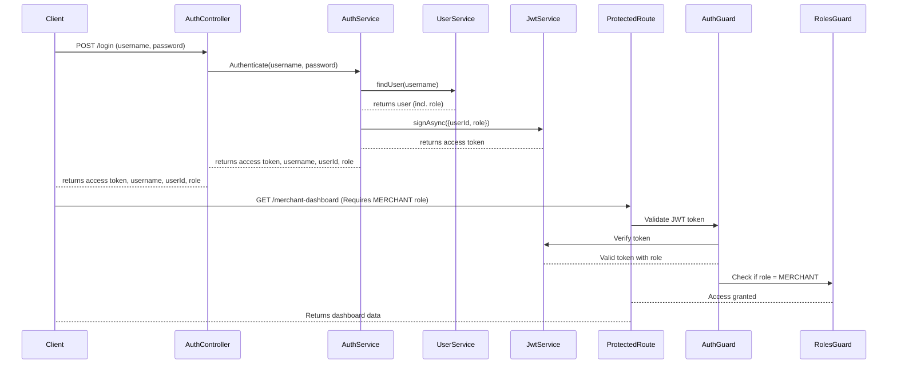

# Database Schema

```mermaid
classDiagram
    class User {
        +id : number <<PK>>
        +email : string
        +password : string
        +name : string
        +role enum: 'merchant', 'customer'
        +created_at : Date
        +updated_at : Date
        +products : Product[]  "1-to-many"
        +orders : Order[]      "1-to-many"
    }
    
    class Product {
        +id : number <<PK>>
        +name : string
        +description : string
        +price : number
        +stock : number
        +created_at : Date
        +updated_at : Date
        +merchant : User       "ManyToOne"
    }
    
    class Order {
        +id : number <<PK>>
        +customer_id : number   "FK -> User.id"
        +status : enum 'pending' , 'paid', 'shipped', 'completed'
        +total_price : number
        +created_at : Date
        +updated_at : Date
        +orderItems : OrderItem[]  "1-to-many"
        +payment : Payment?         "Optional 1-to-1"
    }
    
    class OrderItem {
        +id : number <<PK>>
        +order_id : number   "FK -> Order.id"
        +product_id : number "FK -> Product.id"
        +quantity : number
        +price : number
        +created_at : Date
    }
    
    class Payment {
        +id : number <<PK>>
        +order_id : number   "FK -> Order.id"
        +payment_status : enum 'pending', 'success', 'failed'
        +payment_method : string "e.g., stripe"
        +payment_reference : string "Stripe transaction ID"
        +created_at : Date
        +updated_at : Date
    }
    
    %% Relationships
    User "1" -- "0..*" Product : owns
    User "1" -- "0..*" Order : places
    Order "1" -- "0..*" OrderItem : contains
    Product "1" -- "0..*" OrderItem : appears in
    Order "1" -- "0..1" Payment : may have

```
# Authentication Flow

```mermaid
sequenceDiagram
    Client->>AuthController: POST /login (username, password)
    AuthController->>AuthService: Authenticate(username, password)
    AuthService->>UserService: findUser(username)
    UserService-->AuthService: returns user (incl. role)
    AuthService->>JwtService: signAsync({userId, role})
    JwtService-->AuthService: returns access token
    AuthService-->AuthController: returns access token, username, userId, role
    AuthController-->Client: returns access token, username, userId, role

    Client->>ProtectedRoute: GET /merchant-dashboard (Requires MERCHANT role)
    ProtectedRoute->>AuthGuard: Validate JWT token
    AuthGuard->>JwtService: Verify token
    JwtService-->AuthGuard: Valid token with role
    AuthGuard->>RolesGuard: Check if role = MERCHANT
    RolesGuard-->ProtectedRoute: Access granted
    ProtectedRoute-->Client: Returns dashboard data
```